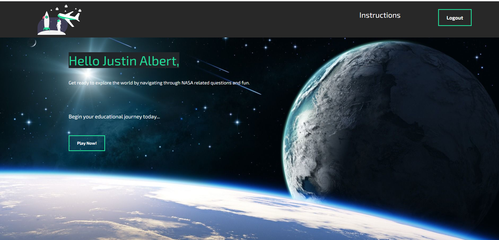

# Space Exploration Game


## Table of Contents

- [About](#About)
- [Installation](#Installation)
- [Details](#Details)
- [Contributing](#Contributing)
- [License](#License)

## About

This full stack MERN application allows you to explore the Earth and the solar system.  You can learn about the wonders of nature as you earn money that can be used to buy new ships.  In the game, you begin by creating an account so that you progress can be saved.  Next you will create a character that you will use to explore the solar system with.  In order to explore you will also need a ship.  You begin with an airplane that allows you to fly around the world.  In order to explore space, you will need to earn credits that can be used to buy a space ship.  You can then fly around Earth or the solar system.  By pressing "l" you can view details about the location you vist.  With this new found knowledge, you can enter the earn phase of the game where you answer quiz questions to make money.  To view the deployed application visit our [HerokuLink](https://gentle-atoll-92825.herokuapp.com/).



## Installation

1.  Clone this repository at [GitHub](https://github.com/oroth8/explorer.git)

```sh
git clone
```

2. Install packages using

```sh
npm i
```

3.  To run the server locally, you will then need to use

```sh
npm run dev
```

## Details

This project makes use of a MERN layout, that is, mondoDB, express, react and node.js.  The server is set up using node.js with express.  This connects to the mongo database which stores all the information we need for game play, character logins and character statistics.  Using react, we then create components for that allow the user to experience the different features we have built into the game.  We then connect from react to the express server using axios.

## Contributing

If you would like to contribute to this package, please contact the author via [email](jalbert@carthage.edu). Provide any details about your proposed changes so that your contribution can be made.

## License

This is free and unencumbered software released into the public domain. Anyone is free to copy, modify, publish, use, compile, sell, or distribute this software, either in source code form or as a compiled binary, for any purpose, commercial or non-commercial, and by any means.

In jurisdictions that recognize copyright laws, the author or authors of this software dedicate any and all copyright interest in the software to the public domain. We make this dedication for the benefit of the public at large and to the detriment of our heirs and successors. We intend this dedication to be an overt act of relinquishment in perpetuity of all present and future rights to this software under copyright law.

THE SOFTWARE IS PROVIDED 'AS IS', WITHOUT WARRANTY OF ANY KIND, EXPRESS OR IMPLIED, INCLUDING BUT NOT LIMITED TO THE WARRANTIES OF MERCHANTABILITY, FITNESS FOR A PARTICULAR PURPOSE AND NONINFRINGEMENT. IN NO EVENT SHALL THE AUTHORS BE LIABLE FOR ANY CLAIM, DAMAGES OR OTHER LIABILITY, WHETHER IN AN ACTION OF CONTRACT, TORT OR OTHERWISE, ARISING FROM, OUT OF OR IN CONNECTION WITH THE SOFTWARE OR THE USE OR OTHER DEALINGS IN THE SOFTWARE.

For more information, please refer to <https://unlicense.org>
