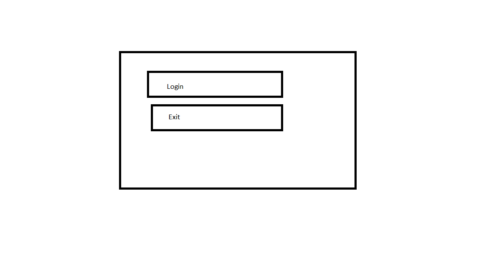
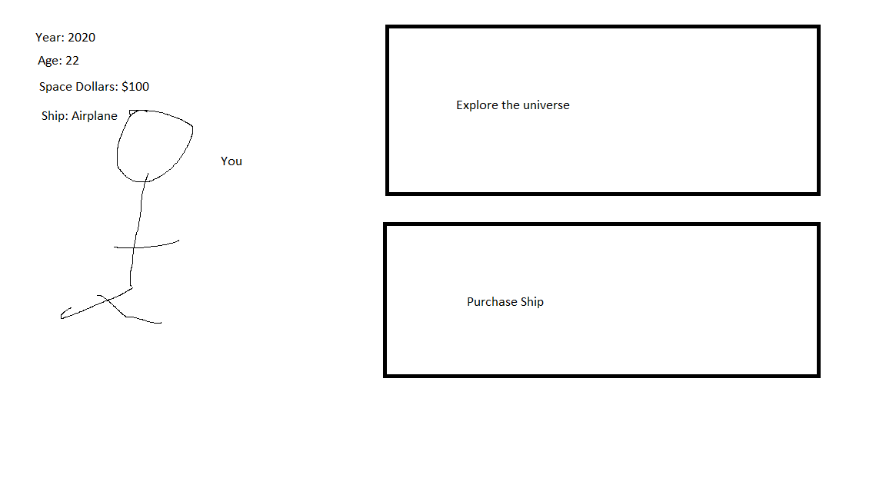
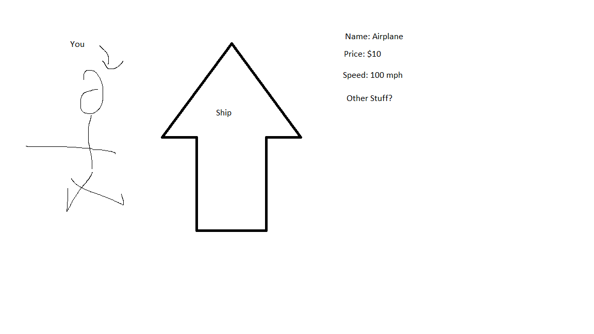
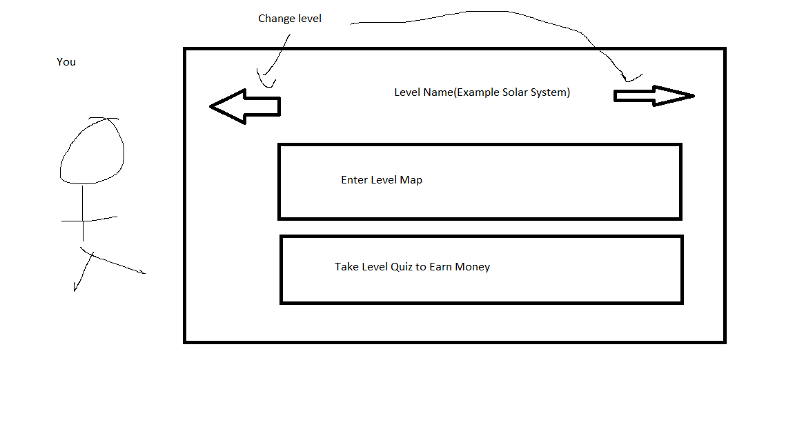
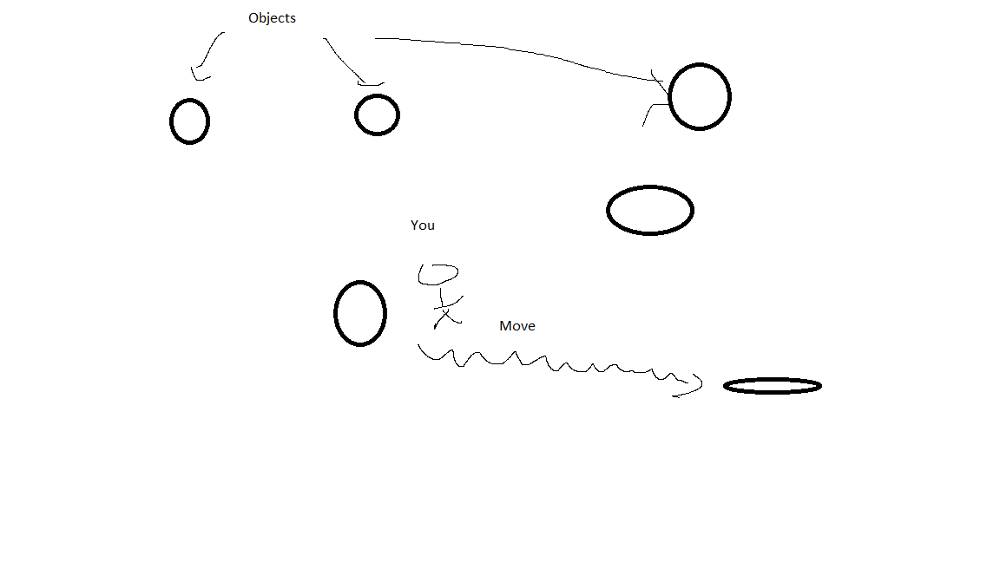
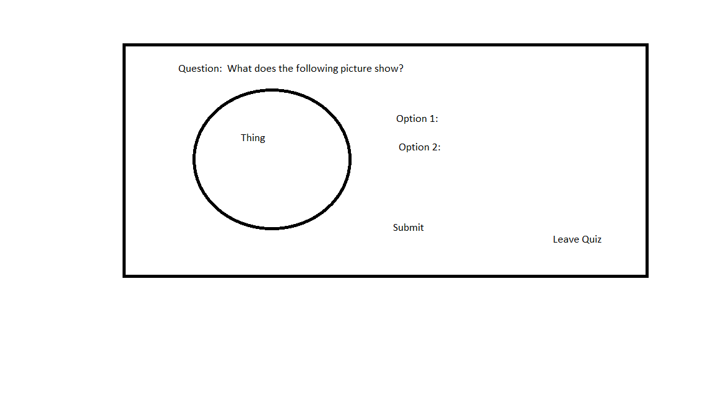
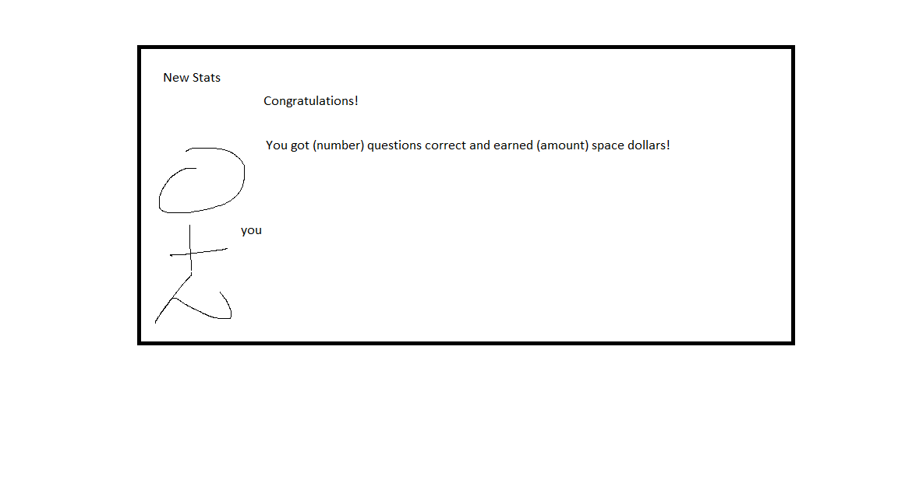

# Space Exploration Game

## Login Page

When you initially open the game, you should be prompted to log in so that your characters information can be called up from the database.

  

## Welcome/Home Page

After logging in, you should see a welcoming page.  Here, you will see a picture of yourself, your stats, and have options to either purchase upgrades or play the game.

  

 ## Purchase

 If you click on the purchase ship area, you will be brought to a page where you can view all the ships.  Ideally, we could have a image of the purchase that will move to each ship when pressed.  If the person is already next to the pressed ship, then a new screen will be brought up with the ship's information.

   

  ## Ship View

  In the ship view screen, you should see yourself next to the ship along with its stats.  If you have enough money, you should be able to purchase the ship.  If the ship has been purchased the purchase button should become a use button so that you can switch between owned ships.

     

  ## Explore Page/Game

  When you enter the game, you should be able to select the level you want to enter.  For each level there should then be two option, an enter level map option where you can learn about the corresponding topics and a take quiz level where you can answer questions for money.

   

  ## Level Map

  On the level map, there should be icons representing objects of interest.  Your avatar should be placed at either the initial point or the last traveled to object.  When the user clicks another object, the avatar should move to this object with the time taken to get there displayed for the user.  This should also update the time and user age.  Then, if the object is pressed again, you should be taken to a page with a picture including interesting details about the object.

     

## Object View

The object view should show a picture and information about the object.

 

## Quiz

If the user enters the quiz screen, they should be prompted with the first question.  Ideally answers would be chosen randomly from a large list.  They should then be able to submit the answer, or quit the quiz at any time.  If the user quits, then no information is saved.  If they complete they quiz, then they should be awarded a certain amount of money for each correct answer.  They should be able to retake these as often as the like, so each level's questions should be worth more money to encourage progression.

 

## Quiz Completion

Upon completion of the quiz, your money should be adjusted and you should be prompted with a congratulations screen.

 

# Conclusion

I see this as the general set up of the game.  Each level should be repeatable an indefinite number of times and the stats should be updated whenever actions occur.  The ships should be viewable at any point, then you should be able change between them after purchasing them.
